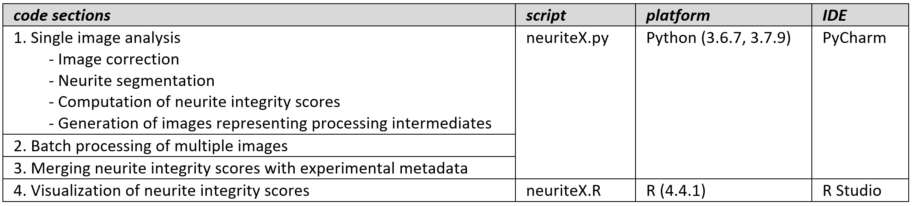
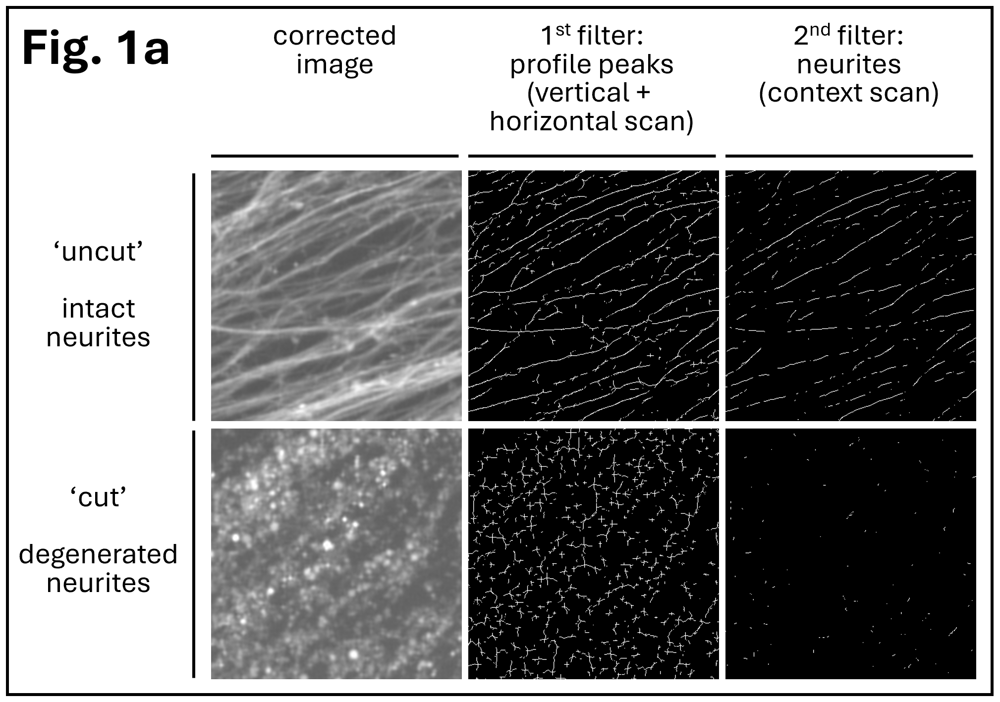
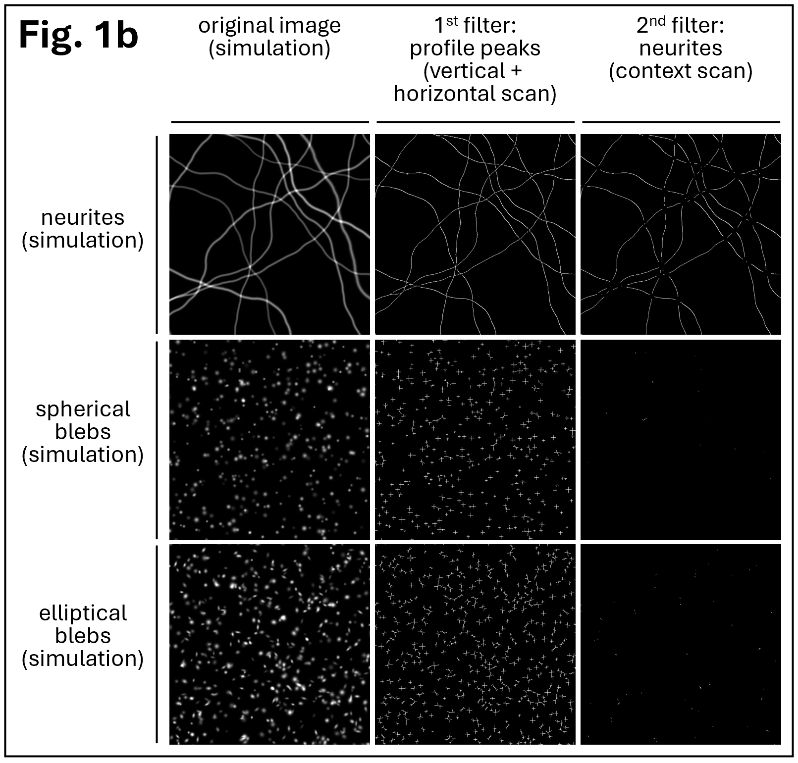
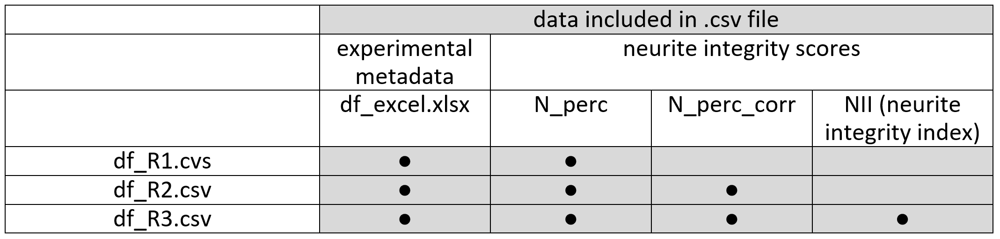
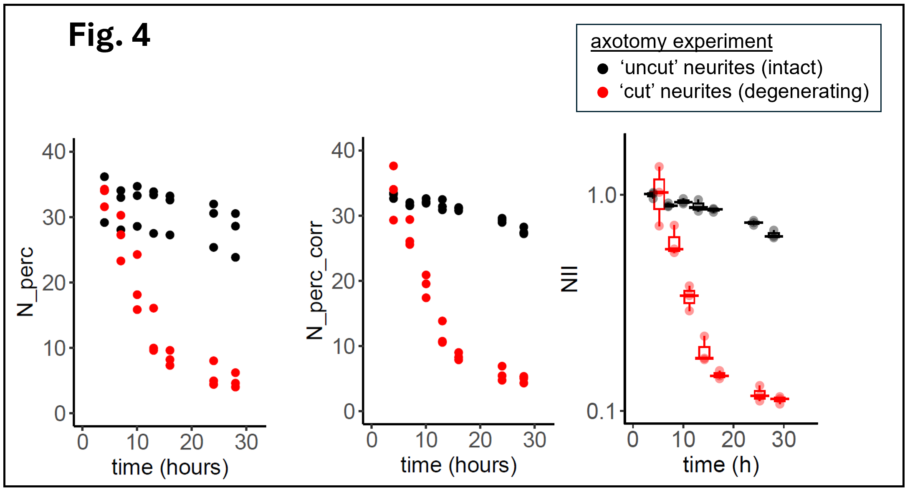

# neuriteX
A collection of functions to quantify degeneration of nerve cell processes (neurites) in microscopy images

## Description
For nerve cells expressing a fluorescent marker, the integrity of neurites (including axons and dendrites) is assessed and quantified using a numerical scoring system. The presented methods are primarily designed for research laboratories investigating neurodegenerative processes.  
The provided step-by-step guide assumes familiarity with Python and R programming languages, as well as proficiency in using the integrated development environments (IDEs) PyCharm and RStudio. While ImageJ (or Fiji) is not mandatory for the analysis, it can be useful for evaluating image stacks of intermediate analysis stages.  

  

## Analysis – first steps

*	Download repository from https://github.com/pmeran/neuriteX/
*	Open PyCharm and create new project folder 'neuriteX_project_folder/'
*	From downloaded repository, transfer folder `img_ori/` and file `neuriteX.py` to project folder created in PyCharm
*	Open `neuriteX.py` in PyCharm and do the following: 
&nbsp;&nbsp;o&nbsp;&nbsp;&nbsp;To import modules and load methods, run code in `neuriteX.py` from first line all the way down to `END OF METHODS` 
&nbsp;&nbsp;o&nbsp;&nbsp;&nbsp;Move to section `# 1. Single image analysis` and find the following line of code: 
&nbsp;&nbsp;&nbsp;&nbsp;&nbsp;&nbsp;&nbsp;&nbsp;`path_main = '<path_main>/neuriteX_root_folder/'` 
&nbsp;&nbsp;&nbsp;&nbsp;&nbsp;&nbsp;&nbsp;&nbsp;then replace `<path_main>` with the absolute path for `neuriteX_root_folder/` 

## 1. Single image analysis (Python)

**Summary**  
To get familiar with the analysis pipeline, it is recommended to first analyze single original images (provided in folder `img_ori/`) by running code section `# 1. Single image analysis` in `neuriteX.py`.  
Images are analyzed in two sequential steps, using two segmentation filters. The first filter identifies pixels corresponding to peaks in cross-sectional intensity profiles. The second filter examines the local surroundings of pixels identified in the first step, and selects them if they are part of neurites (curvilinear structures) or rejects them if they are part of blebs (small spherical or elliptical structures). 
For each image, a raw numerical score `N_perc` (for neurite percentage) is calculated, defined as the percentage of pixels passing the 2nd filter (neurites) versus pixels passing the 1st filter (peaks) (Fig. 1a and 1b). `N_perc` can be retrieved from variable `D`, which is returned by functions `nX_segmentation_test()` and `nX_segmentation()` (see below).  

**Fig. 1.a&nbsp;&nbsp;Image segmentation** 
Images of intact neurites (top left) and degenerated neurites (bottom left) were analyzed using two sequential segmentation filters. `N_perc`, a raw score for neurite integrity, is calculated as the percentage of pixels passing the 2nd filter (neurites) versus pixels passing the 1st filter (peaks). Image edge 400 pixels, or 88.4 µm. 

  
**Fig. 1.b&nbsp;&nbsp;Image segmentation using simulated images** 

  

**Details for code modules in section `#1. Single image analysis`:** 
- **1.1&nbsp;&nbsp;Image display** 
Display of original images in folder `img_ori/`  
- **1.2&nbsp;&nbsp;Image correction** 
Noise reduction, adaptive brightness adjustment, and gamma correction  
Function: 
`imgC, status = nX_correction(imgX, promMin = 5, perc_hi = 95, lim_I_new = 200, gamma = 0.8, win = 3, ord = 2)`  
Returns: 
`imgC`	corrected output image 
`status`	returns 1 if correct, or error code -1 if input image has no detectable structures  
Parameters: 
`imgX`	input image (numpy array, 1196 x 1196, np.uint8) 
`promMin`	minimum peak prominence 
`perc_hi`	percentile of detected peak intensities to use as input intensity pivot for brightness adjustment 
`lim_I_new`	output intensity pivot for brightness adjustment 
`gamma`	gamma correction parameter  
`win`	window size for Savitzky-Golay noise reduction 
`ord`	order for Savitzky-Golay noise reduction  
- **1.3&nbsp;&nbsp;Neurite segmentation and generation of test images** 
Generation of neurite integrity score `N_perc`, and of images representing processing intermediates (output variable `stack`)  
Function: 
`D, stack = nX_segmentation_test (imgC, img_file, ptUL=(10,10), eH=100, extF = 3, win = 3, ord=2, t = 100000)`  
Returns: 
`D`	dictionary with key `N_perc`, the percentage of neurite pixels among pixels corresponding to cross-sectional profile peaks 
`stack`	stack of images representing various stages of analysis (for parameter adjustments); best viewed with ImageJ (Fiji)  
Parameters: 
`imgC`	corrected input image (numpy array, 1196 x 1196, np.uint8) 
`img_file`	filename of original image 
`ptUL`	upper left anchor of image area to be analyzed 
`eH`	half edge length of image area to be analyzed 
`extF`	scaling factor for analysis 
`win`	window size for Savitzky-Golay noise reduction 
`ord`	order for Savitzky-Golay noise reduction 
`t`	number of peak pixels to be selected randomly for image analysis  
- **1.4&nbsp;&nbsp;Neurite segmentation** 
Generation of neurite integrity score  
Function: 
`D = nX_segmentation (imgC, img_file, ptUL=(10,10), eH=100, extF=3, win=3, ord=2, t=100000)`  
Function `nX_segmentation()` is largely identical to function `nX_segmentation_test()`, with the difference that `nX_segmentation()` does not return variable `stack` (a stack of images representing processing intermediates). `nX_segmentation()` is therefore faster and is used for batch processing. 
  

## 2. Batch processing of multiple images (Python)

**Summary**  
In neurodegeneration experiments, conditions are set up in multiplicates and imaged over time, resulting in large image sets that must be analyzed in batch mode. We provide both code and sample images for a batch analysis test run.  
Folder `img_ori/` contains sample images from a neurodegeneration experiment using axotomy. The provided images represent two conditions ('uncut', 'cut'), 3 scenes (i.e. imaging areas) per condition, and 7 acquisition time points for each scene, resulting in a total of 2 * 3 * 7 = 42 images. Spreadsheet `df_excel.xlsx` lists all images and their relation to scenes, conditions, and time points. Since the spreadsheet can get quite complex for larger experiments, and is an integral part for creating charts (described below), it should be generated programmatically, as shown in code section `Create excel spreadsheet`.  
Code for batch image processing makes use of the same functions used for single image processing, and is structured into the following two sections: 
- **2.1&nbsp;&nbsp;Batch processing - image correction** 
- **2.2&nbsp;&nbsp;Batch processing - image segmentation**

Image segmentation is very time intensive, posing challenges for parameter optimization and resulting in very long run times. 
To facilitate <ins>parameter optimization</ins> by reducing compute time, both segmentation functions `nX_segmentation()` and `nX_segmentation_test()` offer the option to minimize the analyzed image area (by tweaking parameters `pUL` = upper left corner, and `eH` = half edge of image area to be analyzed). As a result, setting `eH = 100` takes about 15 seconds, while `eH = 580` takes about 6 minutes to complete. 
<ins>Run times</ins> are considerably shortened by parallelization, as implemented in the provided image segmentation module.  
Batch processing generates a raw neurite integrity score `N_perc` for each image. Scores, along with image names, are stored in file `df_seg.pkl`.  
Image correction and segmentation can also be configured to run as scheduled jobs on a Linux server. Pertinent description and scripts can be found in repository folder `server`.  

## 3. Merging neurite integrity scores with experimental metadata (Python)
This section merges various neurite integrity scores and experimental conditions into .csv output files. 
  

**Definition of neurite integrity scores N_perc, N_perc_corr, and NII (neurite integrity index)** 
- **N_perc** 
N_perc is a raw score of neurite integrity, defined as the percentage of neurite pixels (2nd filter) versus cross-sectional peaks (1st filter) (Fig. 1a, Fig. 1b). N_perc normalizes implicitly for area and overall image complexity. 
- **N_perc_corr** 
N_perc_corr is a corrected version of N_perc, which sometimes is affected by background variability within the same condition or well. 
- **NII (neurite integrity index)** 
The neurite integrity index (NII) results from normalization of N_perc_corr, using the earliest time point (4 h or earlier) of N_perc_corr as reference. NII values cluster around 1.0 for intact neurites, and move closer to 0 as neurites degenerate. 
 
Depending on the experimental details, different ways of correction and normalization may be required (e.g. if acquiring images over time from the same area is not possible; or imaging can only be started after significant neurite degeneration has set in for the axotomized condition) 
 

## 4. Visualization of neurite integrity scores (R)
Script `neuriteX.R` generates charts for neurite integrity scores N_perc, N_perc_corr, and NII (Fig. 3), based on data in previously generated files `df_R1.csv`, `df_R2.csv`, and `df_R3.csv`.  

          

