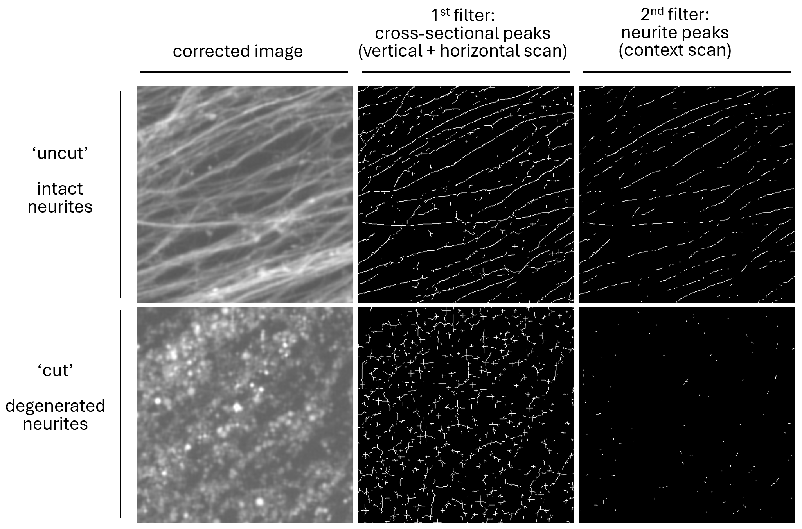

# neuriteX
A collection of functions to evaluate the integrity of neuronal processes (neurites) in microscopy images

## Description
For neurons modified with a fluorescent cytoplasmic marker, a score is computed that reflects the integrity of all neurites (axons and dendrites). The code is primarily intended for research labs in academia and industry that study neurodegeneration. The codebase is written in Python (version 3.6.7, 3.7.9) and R (version 4.4.1) and has been tested in Windows 10.

Image analysis is implemented in Python and includes: image correction; neurite segmentation with computation of raw score, corrected score, and neurite integrity index (NII); and generation of images representing processing intermediates (for optimization of parameters). 
Result visualization is implemented in R. 
 
The provided step-by-step guide requires knowledge of Python and R and the use of IDEs (PyCharm and R Studio).  ImageJ (or Fiji) is not required but is helpful to look at generated image stacks. 

## Analysis – first steps

-	Download repository from https://github.com/pmeran/neuriteX/ and extract locally
-	In PyCharm, create new root folder named 'neuriteX_root_folder/'
-	From downloaded repository, transfer folder `img_ori/` and file `neuriteX.py` to root folder
-	Open `neuriteX.py` in PyCharm
-	Run `neuriteX.py` code from first line all the way down to `END OF METHODS`
-	Move to section `# S_1 - single image analysis` and find the following line of code: 
  `path_main = '<path_main>/neuriteX_root_folder/'` 
  then replace `<path_main>` with absolute path for root folder 

## 1. Single image analysis

Summary 

To get familiar with the analysis pipeline, it is recommended to first analyze single original images (provided in folder `img_ori`) by running code section `# 1. Single image analysis` in `neuriteX.py`.  
In brief, after intensity correction, images are analyzed with two sequential segmentation filters. The first filter identifies pixels corresponding to peaks in cross-sectional intensity profiles. These pixels pass the second filter if - based on examination of their local surroundings - they represent neurites (curvilinear structures) but not blebs (small spherical or elliptical structures). 
A raw numerical score `N_perc` (for neurite percent) is calculated as the percentage of pixels passing the 2nd filter (neurites) versus pixels passing the 1st filter (peaks). `N_perc` can be retrieved from output dictionary `D` as `D['N_perc']`. 

Examples of segmentation performance with real images. 

   

- **1.1&nbsp;&nbsp;&nbsp;Read and display image** 
Read and display image from folder `img_ori/`  
- **1.2 Image correction** 
Reduce noise, adjust brightness, add gamma correction  
Function: 
`imgC, status = nX_correction(imgX, promMin = 5, perc_hi = 95, lim_I_new = 200, gamma = 0.8, win = 3, ord = 2)`  
Returns: 
`imgC`	corrected output image 
`status`	returns 1 if correct, or error code -1 if input image has no detectable structures  
Parameters: 
`imgX`	input image (numpy array, 1196 x 1196, np.uint8) 
`promMin`	minimum peak prominence 
`perc_hi`	percentile of detected peak intensities to use as input intensity pivot for brightness adjustment 
`lim_I_new`	output intensity pivot for brightness adjustment 
`gamma`	gamma correction parameter  
`win`	window size for Savitzky-Golay noise reduction 
`ord`	order for Savitzky-Golay noise reduction  
- **1.3 Image segmentation and generation of test images** 
Generate neurite integrity score, create images of intermediate processing states  
Function: 
`D, stack = nX_segmentation_test (imgC, img_file, ptUL=(10,10), eH=100, extF = 3, win = 3, ord=2, t = 100000)`  
Returns: 
`D`	dictionary with output `N_perc`, the percentage of neurite pixels among all peak pixels 
`stack`	stack of images representing various stages of analysis (for parameter adjustments)  
Parameters: 
`imgC`	(corrected) input image (numpy array, 1196 x 1196, np.uint8) 
`img_file`	filename of original image 
`ptUL`	upper left anchor of image area to be analyzed 
`eH`	half edge length of image area to be analyzed 
`extF`	scaling factor for analysis 
`win`	window size for Savitzky-Golay noise reduction 
`ord`	order for Savitzky-Golay noise reduction 
`t`	number of peak pixels to be selected randomly for image analysis  
- **1.4 Image segmentation** 
Generate neurite integrity score  
Function: 
`D = nX_segmentation (imgC, img_file, ptUL=(10,10), eH=100, extF=3, win=3, ord=2, t=100000)`  
Function `nX_segmentation` is largely identical to function `nX_segmentation_test`, with the difference that the former does not return `stack`. `nX_segmentation` is therefore faster and is used for batch processing. 
  

          

