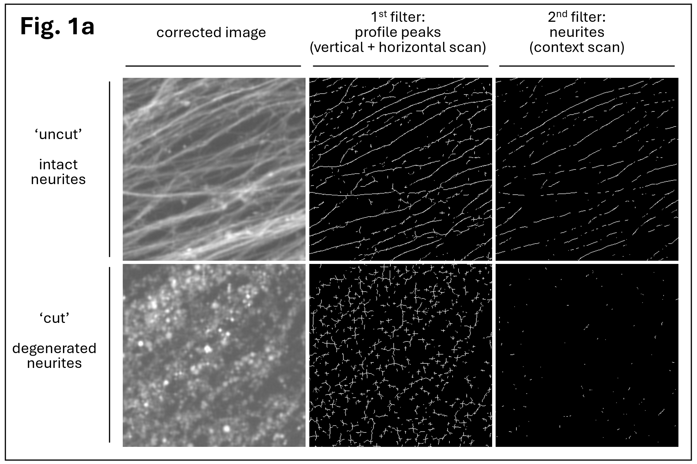
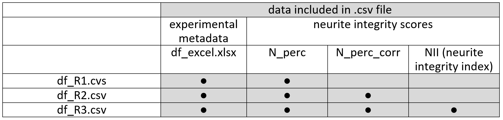
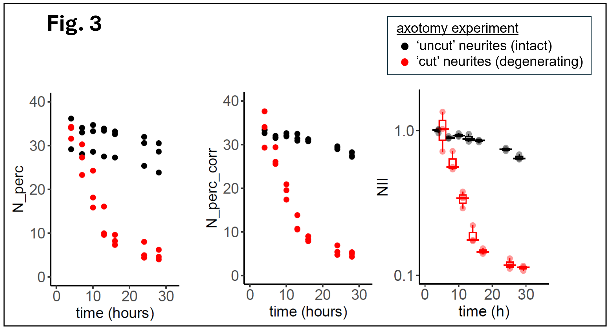

# neuriteX
A collection of functions to quantify degeneration of nerve cell processes (neurites) in microscopy images

## Description
For neurons (nerve cells) expressing a fluorescent marker, the integrity of neurites (axons and dendrites) is evaluated, and a numerical score is returned. The code is primarily intended for research laboratories in academia and industry that study neurodegeneration. The codebase is written in Python (version 3.6.7, 3.7.9) and R (version 4.4.1) and has been tested in Windows 10. 
 
<ins>Image analysis</ins> is implemented in Python and includes: image correction; neurite segmentation with computation of the neurite integrity index (NII); and generation of images representing processing intermediates (for parameter optimization).  
<ins>Visualization of results</ins> is implemented in R. 
 
The provided step-by-step guide requires knowledge of Python and R, and of related IDEs (PyCharm and R Studio). ImageJ (or Fiji) is not required but helpful for evaluation of generated image stacks. 

## Analysis – first steps

*	Download repository from https://github.com/pmeran/neuriteX/
*	Open PyCharm and create new project folder 'neuriteX_root_folder/'
*	From downloaded repository, transfer folder `img_ori/` and file `neuriteX.py` to created root folder in PyCharm
*	Open `neuriteX.py` in PyCharm and do the following: 
&nbsp;&nbsp;o&nbsp;&nbsp;&nbsp;To import modules and load methods, run code in `neuriteX.py` from first line all the way down to `END OF METHODS` 
&nbsp;&nbsp;o&nbsp;&nbsp;&nbsp;Move to section `# 1. Single image analysis` and find the following line of code: 
&nbsp;&nbsp;&nbsp;&nbsp;&nbsp;&nbsp;&nbsp;&nbsp;`path_main = '<path_main>/neuriteX_root_folder/'` 
&nbsp;&nbsp;&nbsp;&nbsp;&nbsp;&nbsp;&nbsp;&nbsp;then replace `<path_main>` with the absolute path for `neuriteX_root_folder/` 

## 1. Single image analysis (Python)

**Summary** 

To get familiar with the analysis pipeline, it is recommended to first analyze single original images (provided in folder `img_ori`) by running code section `# 1. Single image analysis` in `neuriteX.py`.  
Images are analyzed in two sequential steps, using two segmentation filters. The first filter identifies pixels corresponding to peaks in cross-sectional intensity profiles. The second filter examines the local surroundings of pixels identified in the first step, and selects them if they are part of neurites (curvilinear structures) or rejects them if they are part of blebs (small spherical or elliptical structures). 
For each image, a raw numerical score `N_perc` (for neurite percentage) is calculated, defined as the percentage of pixels passing the 2nd filter (neurites) versus pixels passing the 1st filter (peaks). `N_perc` can be retrieved from variable `D`, which is returned by functions `nX_segmentation_test()` and `nX_segmentation()` (further explained below).  

**Fig. 1.a&nbsp;&nbsp;Neurite segmentation** 
Images of intact neurites (top left) and degenerated neurites (bottom left) were analyzed using two sequential segmentation filters. A raw score for neurite integrity is calculated as the percentage of pixels passing the 2nd filter versus pixels passing the 1st filter. Image edge 400 pixels, or 88.4 µm. 

  
**Fig. 1.b&nbsp;&nbsp;Neurite segmentation using simulated images** 

  

Details for modules in section `#1. Single image analysis` in `neuriteX.py`: 
- **1.1&nbsp;&nbsp;Image display** 
Display of original images in folder `img_ori/`  
- **1.2&nbsp;&nbsp;Image correction** 
Noise reduction, adaptive brightness adjustment, and gamma correction  
Function: 
`imgC, status = nX_correction(imgX, promMin = 5, perc_hi = 95, lim_I_new = 200, gamma = 0.8, win = 3, ord = 2)`  
Returns: 
`imgC`	corrected output image 
`status`	returns 1 if correct, or error code -1 if input image has no detectable structures  
Parameters: 
`imgX`	input image (numpy array, 1196 x 1196, np.uint8) 
`promMin`	minimum peak prominence 
`perc_hi`	percentile of detected peak intensities to use as input intensity pivot for brightness adjustment 
`lim_I_new`	output intensity pivot for brightness adjustment 
`gamma`	gamma correction parameter  
`win`	window size for Savitzky-Golay noise reduction 
`ord`	order for Savitzky-Golay noise reduction  
- **1.3&nbsp;&nbsp;Image segmentation and generation of test images** 
Generation of neurite integrity score, and of images reflecting intermediate processing states  
Function: 
`D, stack = nX_segmentation_test (imgC, img_file, ptUL=(10,10), eH=100, extF = 3, win = 3, ord=2, t = 100000)`  
Returns: 
`D`	dictionary with output `N_perc`, the percentage of neurite pixels among all peak pixels 
`stack`	stack of images representing various stages of analysis (for parameter adjustments)  
Parameters: 
`imgC`	(corrected) input image (numpy array, 1196 x 1196, np.uint8) 
`img_file`	filename of original image 
`ptUL`	upper left anchor of image area to be analyzed 
`eH`	half edge length of image area to be analyzed 
`extF`	scaling factor for analysis 
`win`	window size for Savitzky-Golay noise reduction 
`ord`	order for Savitzky-Golay noise reduction 
`t`	number of peak pixels to be selected randomly for image analysis  
- **1.4&nbsp;&nbsp;Image segmentation** 
Generation of neurite integrity score  
Function: 
`D = nX_segmentation (imgC, img_file, ptUL=(10,10), eH=100, extF=3, win=3, ord=2, t=100000)`  
Function `nX_segmentation()` is largely identical to function `nX_segmentation_test()`, with the difference that the former does not return variable `stack` (a stack of images representing processing intermediates). `nX_segmentation()` is faster and is used for batch processing. 
  

## 2. Batch processing of multiple images (Python)

**Summary** 
Neurodegeneration experiments compare multiple conditions set up in multiplicates over time, and therefore require analysis of large image numbers in batch mode. We provide both code and sample images for a batch analysis test run. 
Folder `img_ori` contains sample images from a neurodegeneration experiment using axotomy. The provided images represent two conditions ('uncut', 'cut'), 3 scenes (i.e. imaging areas) per condition, and 7 acquisition time points for each scene, resulting in a total of 2 * 3 * 7 = 42 images. Spreadsheet `df_excel.xlsx` lists all images and their relation to scenes, conditions, and time points. Since the spreadsheet can get quite complex for larger experiments, and is an integral part for creating charts (described below), it should be generated programmatically, as shown (code section `Create excel spreadsheet` in file `neuriteX.py`).  
Code for batch image processing is structured into the following two sections: 
- **2.1&nbsp;&nbsp;Batch processing - image correction** 
- **2.2&nbsp;&nbsp;Batch processing - image segmentation**

Both modules make use of the same functions used for single image processing.  
Image segmentation is very time intensive, posing challenges for parameter optimization and resulting in very long run times. 
To facilitate <ins>parameter optimization</ins>, both segmentation functions `nX_segmentation()` and `nX_segmentation_test()` offer the option to minimize the analyzed image area (by tweaking parameters `pUL` = upper left corner, and `eH` = half edge of image area to be analyzed). As a result, setting `eH = 100` takes about 15 seconds; while `eH = 580` takes about 6 minutes to complete. 
<ins>Run times</ins> were considerably shortened by parallelization. To cope with run times of several hours, we successfully ran the code without major tweaks on a Linux compute cluster (sample scripts are given in folder `src_cluster`).  
Batch processing generates a raw neurite integrity score `N_perc` for each image, and stores values in file `df_seg.pkl`.  

## 3. Merging neurite integrity scores with experimental metadata (Python)
This section merges various neurite integrity scores and experimental conditions into several .csv output files. 
  

**Definition of neurite integrity scores N_perc, N_perc_corr, and NII** 
- **N_perc** 
N_perc is a raw score of neurite integrity, defined as the percentage of neurite pixels (2nd filter) versus cross-sectional peaks (1st filter) (Fig. 1a, Fig. 1b). N_perc normalizes for area and overall image complexity. 
- **N_perc_corr** 
N_perc_corr is a corrected version of N_perc, which to some extent is affected by background variability. 
- **NII (neurite integrity index)** 
The neurite integrity index (NII) results from normalization of N_perc_corr, using the earliest time point (4 h or earlier) of N_perc_corr as reference. 
NII values cluster around 1.0 for intact neurites, and move closer to 0 as neurites degenerate. 
 
It should be emphasized that, depending on the experimental details, different ways of correction and normalization may be required (e.g. if acquiring images over time from the same area is not possible; or imaging can only be started after significant neurite degeneration has set in) 
 

## 4. Visualization of neurite integrity scores (R)
Script neuriteX.R generates charts for neurite integrity scores N_perc, N_perc_corr, and NII (Fig. 3). Charts are created based on files df_R1.csv, df_R2.csv, and df_R3.csv, respectively.
 

          

